# SQL Homework - Employee Database: A Mystery in Two Parts

## Background

It is a beautiful spring day, and it is two weeks since you have been hired as a new data engineer at Pewlett Hackard. Your first major task is a research project on employees of the corporation from the 1980s and 1990s. All that remain of the database of employees from that period are six CSV files.

In this assignment, you will design the tables to hold data in the CSVs, import the CSVs into a SQL database, and answer questions about the data. In other words, you will perform:

1. Data Engineering / Data Modeling
2. Data Analysis

#### Data Modeling
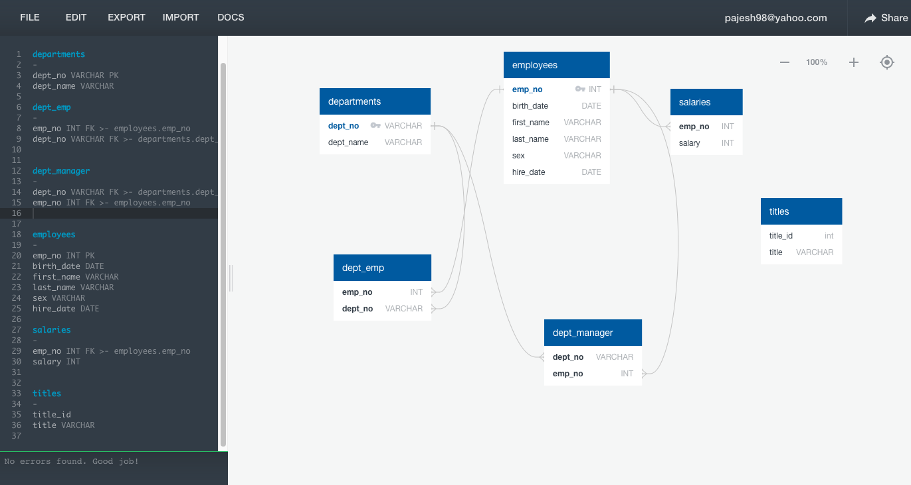

#### Data Engineering

* Created a table schema for each of the six csv files. 
  * To determine the primary keys. I checked to see if the column is unique. If not then created a composite key which takes to the primary keys in order to uniquely identify the records.
  * Imported each csv file into the each table. It was very important to import the data in same order as the table were created.

#### Data Analysis

Once you have a complete database, do the following:

1. List the following details of each employee: employee number, last name, first name, sex, and salary.
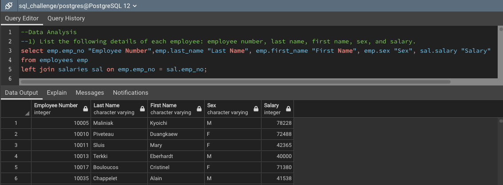

2. List first name, last name, and hire date for employees who were hired in 1986.
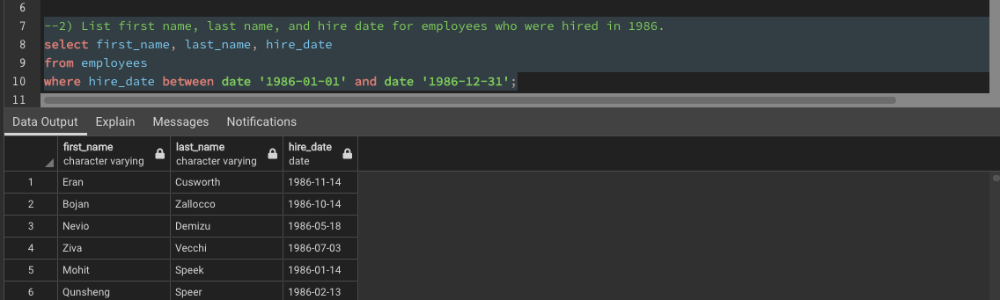

3. List the manager of each department with the following information: department number, department name, the manager's employee number, last name, first name.
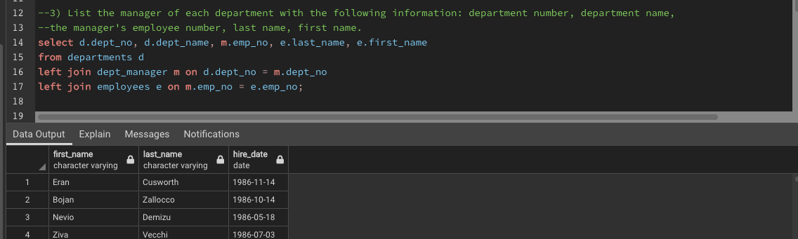

4. List the department of each employee with the following information: employee number, last name, first name, and department name.
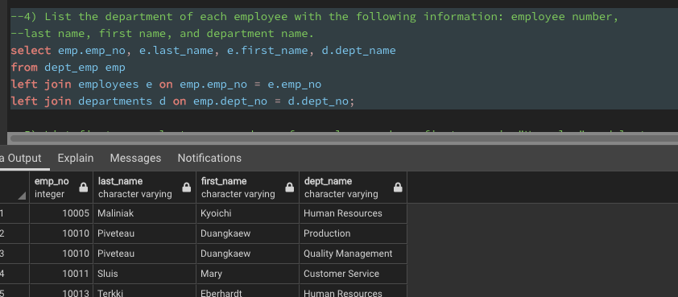

5. List first name, last name, and sex for employees whose first name is "Hercules" and last names begin with "B."
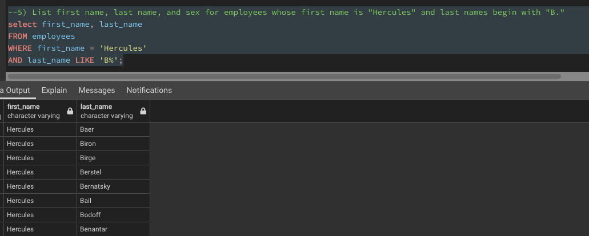

6. List all employees in the Sales department, including their employee number, last name, first name, and department name.
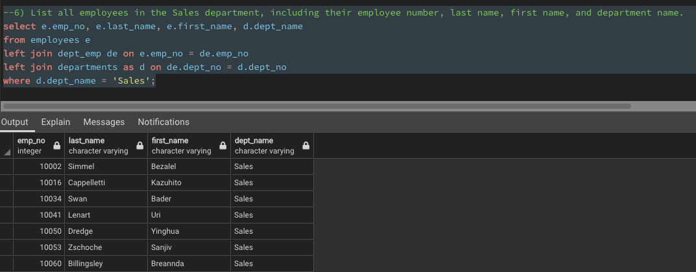

7. List all employees in the Sales and Development departments, including their employee number, last name, first name, and department name.
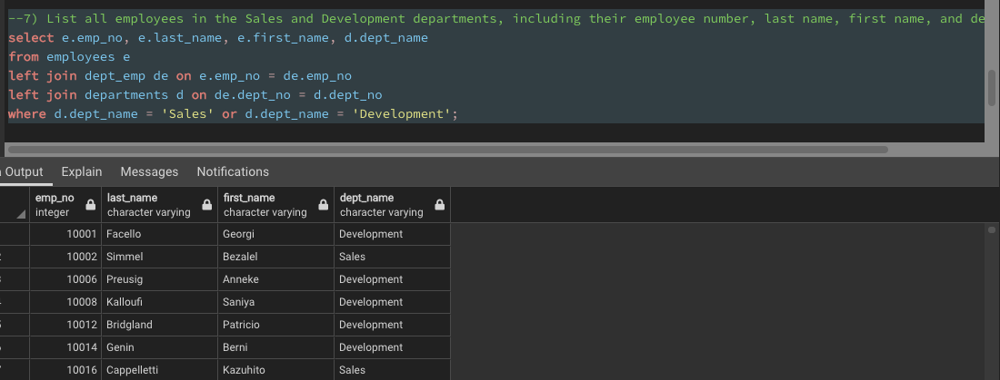

8. In descending order, list the frequency count of employee last names, i.e., how many employees share each last name.
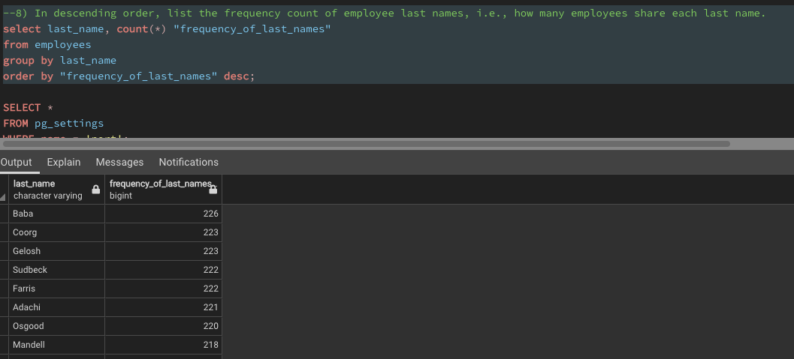

## Bonus (Optional)

As you examine the data, you are overcome with a creeping suspicion that the dataset is fake. You surmise that your boss handed you spurious data in order to test the data engineering skills of a new employee. To confirm your hunch, you decide to take the following steps to generate a visualization of the data, with which you will confront your boss:

1. Import the SQL database into Pandas. 
2. Created a historgram to visualize the most common salary ranges for employees

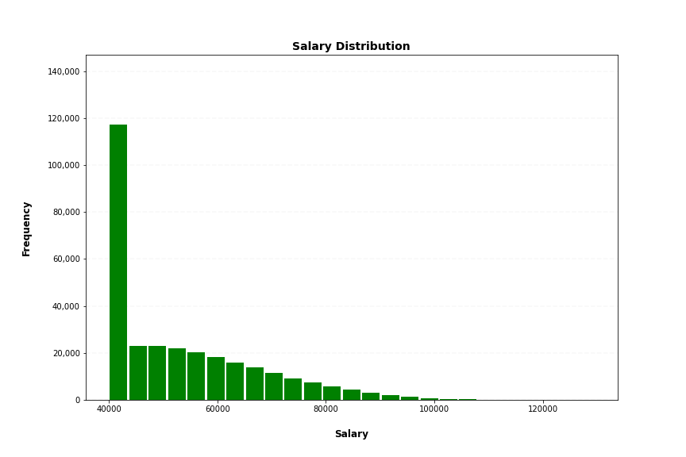

3. Create a bar chart of average salary by title.

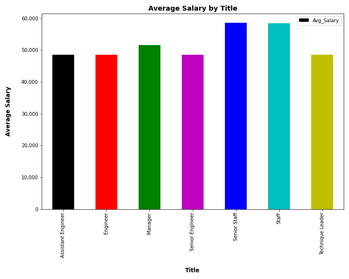

## Epilogue

Evidence in hand, you march into your boss's office and present the visualization. With a sly grin, your boss thanks you for your work. On your way out of the office, you hear the words, "Search your ID number." You look down at your badge to see that your employee ID number is 499942.

